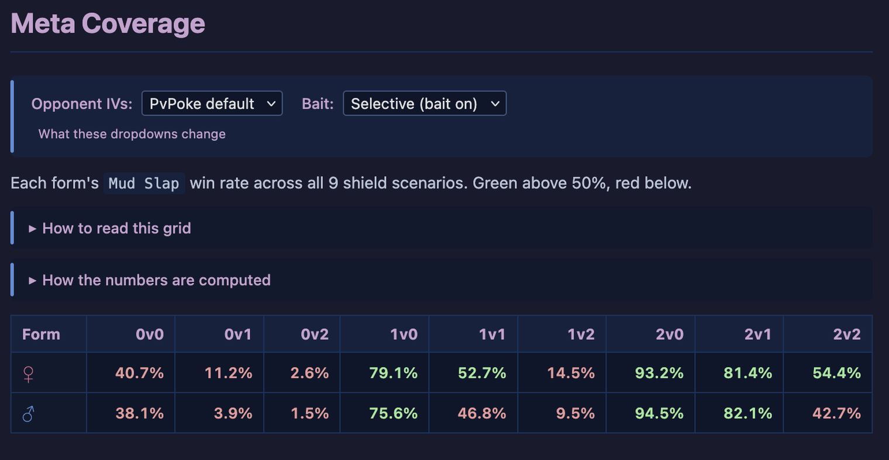

A **CD article** is a short, opinion-shaped page we publish ahead of
each Community Day. It pairs the incoming CD move with a per-scenario
read on whether the move is actually worth chasing, which of the
species's forms benefits most, and which IVs inside each form get the
biggest lift. It's the page you should open first when Niantic
announces the next CD; the per-species deep dives are the page you
open when you've decided the species is worth a dust commit and you
want to pick a specific IV.

This guide walks through what each section of a CD article shows, how
to read the tables and cards, and where the article intentionally
differs from the dive pages it links to.

## When a CD article gets written

One CD article goes up for every announced Community Day we cover, a
week or two before the event. The reference this guide uses -
[Oinkologne Community Day: Is Mud Slap Worth It?](../../articles/oinkologne-cd-2026-05/) -
was written for the 2026-05-09 CD that adds Mud Slap to both
{{dive:species_display}} forms.

Each article links to its paired deep dive pages (one per form, when
the species has form splits). The dive pages give you the full
threshold-tier cards, the scatter plot, and the Notable IVs section.
The CD article is explicitly the "what's new, was it worth it, which
form do I build" layer on top of those.

## The banner bar: who wrote this

Every CD article opens with a coloured authorship banner so you can
tell at a glance whether the prose is human-authored, human-supported,
or purely auto-generated.

- **Gold banner ("written by a human analyst")**: the narrative
  sections were written by an expert. Opinions in the Meta Role,
  Verdict, and IV Recommendations prose are load-bearing and reflect
  editorial judgment.
- **Green banner ("human-written analysis supported by simulation
  data")**: hybrid - human-written prose with generated tables and
  grids woven in.
- **Blue banner ("auto-generated from simulation data")**: the prose
  was produced by our templated narrative generator. The shapes and
  numbers are mechanical; any editorial framing ("switch GL pick,"
  "clear upgrade") comes from a small vocabulary of auto-gen patterns,
  not from a human taking a stance.

The reference Oinkologne article is currently auto-generated (blue
banner) - readable, numerically accurate, and deliberately low-opinion.
When a human expert signs off on it later, the banner turns gold or
green and the attribution line below each narrative block updates to
match.

## The obsolescence banner

When an article ages past the event it was written for, or when a
simulator change reshuffles its conclusions, we add a **red "This
article is outdated" banner** at the top and a dated note explaining
what changed. The article stays live - its numbers at time of writing
are sometimes still useful for historical comparison - but the banner
is an explicit "don't treat this as current advice."

No banner visible means the article is current.

## Section by section, top to bottom

### Introduction

One paragraph answering: what move is the species getting, what does
that move do to the species's overall win rate, what are the biggest
three matchups flipping in, what two or three are flipping out, and
when is the CD. If you read only the Introduction you should be able
to decide whether the CD is worth powering a new one.

### Stats at a Glance

A small table showing each form's rank-1-IV stats (Attack, Defense,
HP) alongside the form's rank-1 IV triple and the level-at-cap. For
{{dive:species_display}} it's the two-column Female/Male readout; for
a single-form species it collapses to one column.

### Meta Role

The longest prose section. A type-by-type walk through the matchups
the new CD move flips into wins (or out of wins). The prose groups
wins and losses by opponent typing: "flips the Steel bucket x1.6,"
"vs Ghost-type," "vs Water-type." This is where you see the shape of
the upgrade. Read the gains list to confirm the species gains
coverage you actually want; read the losses list to see whether the
new move costs you a matchup you were relying on.

Numbers in this section are the per-opponent win rates at PvPoke's
default opponent IVs with bait enabled, averaged across all nine
shield scenarios.

### Move Comparison

A side-by-side table of the old default fast move vs the CD fast
move: type, power, energy gain, turns, DPT, EPT, STAB. This is the
raw mechanical delta - the Meta Role section is the downstream
consequence of this table.

### Fast Moves / Charged Moves

Tables listing every move the species can learn, legal or legacy.
Grayed rows are legacy; unshaded rows are currently accessible without
ETM. Useful for deciding whether a **Legacy** tag on a preferred
moveset is a dealbreaker or not.

### Meta Coverage

A per-form grid with one row per form and one column per shield
scenario (0v0, 0v1, 0v2, 1v0, 1v1, 1v2, 2v0, 2v1, 2v2). Cell value is
the form's win rate on the CD moveset at that shield count, coloured
green above 50% and red below.

<figure>

<figcaption>
The Meta Coverage section of the Oinkologne CD article. The dropdown
control row (<strong>Opponent IVs</strong> / <strong>Bait</strong>)
re-writes every cell instantly without re-simulating; the two
collapsed <code>&lt;details&gt;</code> lines point at the prose
explaining how to read the grid and how the numbers are computed.
Below that, the 2-row grid: ♀ Female
is the pink row, ♂ Male
is the blue row. Green cells are win rates above 50% (form wins
that shield scenario outright), red cells are below 50% (form
loses). Shield asymmetry dominates the extremes: 2v0 / 2v1 cells
read green near 100% for both forms, 0v1 / 0v2 cells read red near
zero — per the prose below, the interesting reading is
<em>within a column</em> (does form choice swing the outcome
at a given shield count?).
</figcaption>
</figure>

#### How to read the shield-scenario grid

Shield asymmetry dominates the extremes: **2v0** (you have two, they
have none) is essentially a free win, and **0v2** is essentially a
free loss, regardless of species or form. So the interesting reading
isn't the absolute numbers in the corners - it's **within a column**:
does form choice swing the outcome at a given shield count?

Most players give the **even-shield scenarios** (0v0, 1v1, 2v2) more
weight when team-building, because those are the states opponents
most often end up in after mutual shield trades. Playstyle matters
too - an aggressive shielder weights 0v0 / 0v1 / 0v2 more; a
shield-hoarder weights 2v0 / 2v1 / 2v2 more.

#### Dropdown control

The Meta Coverage section carries a small **dropdown control** that
rewrites the numbers in both this grid and the Matchup Delta table
below:

- **Opponent IVs: PvPoke default vs Rank 1** - switches every
  opponent's IV spread between PvPoke's current default and the
  opponent's highest-stat-product IVs. Rank-1 opponents are marginally
  bulkier; matchups sitting on a breakpoint edge can flip with the
  switch.
- **Bait: Selective vs Never** - disables bait-first shielding so the
  opponent never concedes a bait-move shield. Some matchups that
  depend on bait-bait-nuke sequencing flip when the opponent refuses
  to bite.

Sections above and below Meta Coverage are fixed at PvPoke-default +
bait-on and don't react to the dropdown.

### Matchup Delta

The per-opponent table underneath Meta Coverage. One row per opponent,
one column per form-plus-move combo. Cells show the form's win rate on
the CD move, the form's win rate on the old move, and the signed delta
in percentage points. Rows where a form flips a matchup (crosses 50%
in either direction) are tinted green or red.

Click any column header to sort. The most common useful sort is by one
form's CD-move delta descending - the rows that bubble to the top are
the biggest incoming wins. Sorting the same column ascending shows the
biggest drops.

Above the table is a **PvPoke multi-battle link** per form - one click
opens a PvPoke multi-battle page with the opponent pool, the form's CD
moveset, and the default IVs pre-filled, so you can eyeball any row in
PvPoke's native simulator without re-entering anything.

### Female vs Male (form-comparison)

Only shown for species with form splits. A compact read on which form
wins more scenarios on the shared opponent pool. Contains:

- **Base Stats** - side-by-side attack/defense/stamina (distinct from
  Stats at a Glance, which showed rank-1 derived values).
- **Moveset** - verifies both forms are running the same moves (they
  usually are, but worth confirming).
- **Verdict** - the single-line "Form A wins X%, Form B wins Y%" on
  the shared pool.

For {{dive:species_display}}, the verdict reads "Female 47.8% vs Male
43.8%" on the reference article - a visible but not decisive lean.
Which form to power depends on which of the {{dive:opponent_count}}
opponents your team actually needs to answer, which is what the
Matchup Delta table above is for.

### IV Recommendations

A card grid, one card per tier cut-off per form. Each card shows:

- The tier name (`Lapras Slayer`, `Fortified Greedent`, `Wigglytuff
  Slayer`, etc.).
- The stat cutoffs to hit it.
- The member count out of {{dive:iv_space_size}} IVs.
- A one-line description of what matchups the cut buys you.

Cards link directly into the corresponding tier card on the paired
deep dive, so clicking through gives you the full threshold ladder
with per-scenario bullets. Female cards are tagged with a female
glyph and blue tint; Male cards use a male glyph and pink tint. New
to threshold tiers? The
[Threshold Tiers guide](../threshold-tiers/) walks through what the
cut-offs and member counts mean.

### Verdict

One green callout box at the bottom - the article's headline
conclusion. For Oinkologne: "Clear upgrade: Mud Slap wins every shield
scenario." Above the Verdict, the top-of-article `upgrade` / `sidegrade`
/ `skip` badge on the meta line is the one-word version of the same
judgment.

## What's in the CD article but NOT in the dive pages

- The **Move Comparison table** (old vs new move side by side). A dive
  page doesn't know about the "old" move; it sweeps whichever movesets
  are configured.
- The **Matchup Delta table** (per-opponent old-vs-new deltas). A dive
  page shows absolute win rates per moveset, not deltas.
- The **Female vs Male** pairwise read. Each dive only knows about one
  form; the comparison is synthesized at the article level.
- The **PvPoke multi-battle link** with both forms pre-loaded.
- The **Verdict** callout and the one-word framing badge.

## What's in the dive pages but NOT in the CD article

- The **Scatter plot**. CD articles don't embed a Plotly figure - the
  article is paper-readable. The dive page is where you go to see
  every IV as a point. See the
  [Deep-Dive Scatter guide](../deep-dive-scatter/) for the scatter
  controls.
- The **Threshold Tier cards in full**, with their member IV lists and
  envelope tags. The article grid links into them.
- The **IV Flavor Guide** (the purple narrative zone above the tier
  cards). That's a dive-page surface; the CD article's IV
  Recommendations section condenses to the tier cutoffs without the
  flavor prose.
- The **"Check my collection" paste-box**. That's a scatter-plot
  feature, dive-page only.

## How the CD article and the dive pages stay in sync

Every CD article is generated from the paired deep dives' data plus a
CD-specific TOML block (`cd_prep`) that carries the pre-CD move the
species is getting. When we re-run the dives, the article regenerates
on the same publish and the numbers in both surfaces update together.
That's why the article doesn't carry its own numerical methodology
footer - the methodology is the dive's methodology, and the article
embeds compact "How the numbers are computed" pull-outs that link back
to the [How This Works guide](../how-this-works/) for the full story.

## Where to go next

- **[How This Works](../how-this-works/)** - the one-page overview of
  what the simulator does and how we check it against PvPoke.
- **[Deep-Dive Scatter](../deep-dive-scatter/)** - the interactive
  scatter plot that the CD article's IV Recommendations section
  points into.
- **[Threshold Tiers](../threshold-tiers/)** - what the stat cutoffs
  and member counts on the IV Recommendations cards actually mean.
- **[IV Flavor Guide](../iv-flavor-guide/)** - the purple narrative
  zone on the dive pages that the CD article's IV Recommendations
  section is a distillation of.
