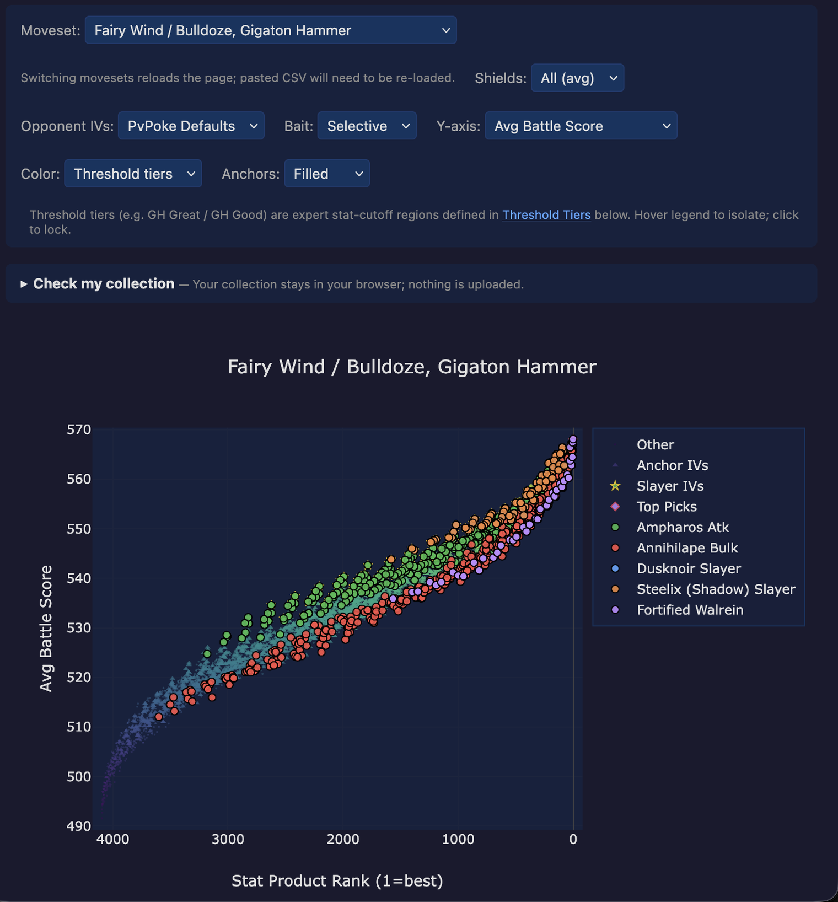

The **scatter plot** is the centerpiece of every deep dive. Each of
the {{dive:iv_space_size}} legal IV spreads becomes one point on the
plot, positioned by stat-product rank on the x-axis and by battle
outcome on the y-axis. The plot is a Plotly figure, so every point is
hoverable and the legend is clickable.

It's where you go when the tier cards and the IV Flavor Guide have
narrowed things down and you want to see **which specific IV spreads**
land where.

<figure>

<figcaption>
Scatter plot from the Tinkaton UL dive. The control strip across the
top (Moveset / Shields / Opponent IVs / Bait / Y-axis / Color / Anchors)
re-renders the plot instantly without re-simulating. On the plot
itself, each dot is one of 4,096 IV spreads. The triangle markers
labelled <strong>Anchor IVs</strong> in the legend trace the reference
cohort's score band; the coloured overlays
(Ampharos Atk,
Annihilape Bulk,
Dusknoir Slayer,
Steelix (Shadow) Slayer,
Fortified Walrein)
are the named categories the IV Flavor Guide and Threshold Tiers
reference by name. Click any legend entry to toggle its visibility.
</figcaption>
</figure>

## Axes, at a glance

- **x-axis: stat-product rank.** Lower rank is to the left (rank 1 at
  the leftmost edge, rank {{dive:iv_space_size}} at the rightmost).
  Two IV spreads with identical stat products get tied ranks, which
  is why the x-axis can look slightly discrete in places.
- **y-axis: the selected outcome mode.** Defaults to average battle
  score across the dive's opponent pool and shield scenarios. Higher
  is better.

The y-axis responds to the **Y-axis** dropdown in the control strip
above the plot: average score, win count (out of {{dive:opponent_count}}
opponents), scenario wins (out of {{dive:opponent_count}} &times;
{{dive:scenario_count}} = per-scenario totals), and a couple of mode-
specific variants. When the y-axis is a wins count, the hover card
shows "won / total" rather than an averaged score.

## The control strip above the plot

The strip of dropdowns above the plot is what makes the scatter
interactive. Each dropdown is non-destructive: changing one re-renders
the colours or y-values without rebuilding the underlying data, so
flipping between views is instant.

- **Moveset** (only shown when the dive covers multiple movesets) -
  switches the plot to a different fast/charged move combination.
  Re-runs the per-opponent score map for the new moveset.
- **Shields** - {{dive:scenario_count}} per-scenario options (`0v0`,
  `0v1`, ..., `2v2`) plus `All (avg)`. The per-scenario views narrow
  the score down to one shield configuration; `All (avg)` is the
  default and shows the pool-wide average.
- **Opponent IVs** (when the dive ran with `--opp-ivs both`) -
  switches opponents between PvPoke's default IV spreads and each
  opponent's rank-1-by-stat-product IV spread. Rank-1 opponents are
  marginally bulkier;
  matchups on a breakpoint edge can flip across the switch.
- **Bait** (when the dive ran with `--bait both`) - disables
  bait-first shielding so the opponent never concedes a bait-move
  shield. Useful for sanity-checking how much of the species's score
  is leaning on bait sequences.
- **Y-axis** - see above.
- **Color** - re-colours every point by one of: Threshold tiers (the
  default), HP, Defense, Attack, or Score. "Threshold tiers" colours
  by which named tier card the IV belongs to and is what the legend
  shows. The other four modes turn the plot into a raw heatmap across
  that stat axis, useful for spotting a stat band you couldn't see
  with the tier colouring on.
- **Anchors** - switches the Anchor IVs overlay between two display
  modes:
    - **Filled** (default) - the Anchor IVs cohort renders as a soft
      colour band across the rank axis. Easier to read at a glance:
      "is my IV spread above or below the band?" answers the
      envelope-position question directly.
    - **Outline** - the Anchor IVs cohort renders as ring markers
      (one per anchor IV spread). Use this when a rider-top category
      sits inside the Filled band and you want its trace to read
      clearly without the fill behind it.
  Pick **Filled** when reading the band as a baseline; pick **Outline**
  when comparing a specific category trace against the band.

Changing any of these **rebinds every other surface on the page** -
the Top IVs table, the per-IV hover card, the anchor-clear bullet
lists - so the whole page stays consistent with whichever slice of
the dive you're currently looking at.

## The Anchor IVs band

Every dive overlays a band of **Anchor IVs** on the plot - a reference
set of IVs (usually rank-1-by-stat-product or a narrow ring around it)
that represents "what you'd naturally build if you stopped optimizing."
The band traces what score the anchor set produces across every
stat-product rank, so any point above the band is doing something the
rank alone doesn't buy you.

The envelope position of each named category (see the
[Envelope Position guide](../envelope-position/)) is derived from this
band: rider-top categories sit persistently above it, rider-bottom
persistently below, straddlers mixed.

The `Anchors` dropdown flips the band between a filled blob (easier
to see at a glance) and an outlined ring (easier to read *through* to
named category traces that sit inside it).

## The hover card

Hover any point and you get a compact summary:

- **IVs**: the canonical `atk/def/hp` triple (e.g. `15/11/11`).
- **Level and CP**: `L50 CP1499`.
- **Computed stats**: `Atk 116.50`, `Def 102.78`, `HP 161` - the
  effective stat values at that level.
- **Stat-product rank** and **battle rank** on the currently-selected
  y-axis.
- **Y-value** on the current y-axis - either an averaged score
  ("Score: 539.3") or a "won / total" count.
- **Tier** - which tier card, if any, this IV belongs to. Also
  doubles as the legend colour.
- **Slayer** - which of the Atk/Bulk/CMP slayer categories the IV
  falls into (if any), pulled from the iterative slayer-discovery
  output.
- **&Delta; vs #1** - signed battle-score delta from rank-1 under the
  current y-axis. Negative means you give up that many points for the
  trade. Hidden on rank-1 itself (always zero).
- **Mirror CMP** - what fraction of the same-species top-50 IV cohort
  on this dive your IV at-least-ties on attack. Dropdown-independent;
  purely atk-based.
- **Clears** - the named anchors this IV passes. Compact abbreviated
  list so the tooltip doesn't blow up.
- **Yours** (if you've pasted a collection - see below) - the IV
  nicknames and hatch dates of any of your own Pokemon sitting at
  this exact IV triple.

## "Check my collection": the paste-box

Below the control strip is a collapsible **"Check my collection"**
panel. Paste your Poke Genie CSV export into the textarea (or click
"Choose file..." to upload one), and every matching IV spread on the
plot gets circled. Everything runs client-side - nothing is uploaded.

Two useful follow-ups once your collection is on the plot:

- The per-tier card's **"of yours"** section lights up, showing which
  of your mons (by nickname and hatch date) clear each tier's
  cutoffs.
- Ticking **"Show only my mons"** dims everything except your circled
  IVs, which is the fastest way to spot whether you already own
  something in a rider-top band.

An inline "enter one at a time" form below the CSV box lets you add a
single IV manually - handy when you're weighing a specific trade or
want to test a hypothetical build without editing your CSV.

## Highlight IVs: the ad-hoc pin

Right below the plot, to the right of the legend, is a small
**Highlight IVs** input. Type a comma-separated list of IV triples
(`15/11/11, 15/14/8`, also accepts `-` or whitespace as separators)
and those specific IVs render as red diamonds on top while the rest
of the plot dims to about 30% opacity. Enter applies; Escape clears.

This is orthogonal to the collection paste-box - highlight is an ad-
hoc "pin these now" tool, not a persistent user state. Useful when a
Discord conversation is referencing a specific IV and you want to
point to it on the scatter without loading a whole CSV.

## Reading patterns

A few things the scatter is especially good at:

**Find my IV spreads on the plot.** Paste your collection, switch the
color mode to Threshold tiers, and scan for green dots in a tier card
you care about. If none of your mons sit in that card's colour, you
know you need to catch or trade for a qualifying IV spread.

**Compare two colour modes.** Flip the color dropdown between
`Threshold tiers` and `Attack`. Tier colour shows you which
categorical cuts the IV clears; attack colour shows you the
underlying stat the cut is derived from. Shifts in where the warm
colours concentrate tell you whether a tier is atk-driven or def/hp-
driven.

**See if a rare IV spread is worth chasing.** Sort the Top IVs table
by `Top-Mirror CMP %` descending and cross-reference with the scatter:
high-CMP IV spreads with low battle-rank penalty are the XL-candy
picks. The
hover card's `&Delta; vs #1` line is the direct readout of "how much
score do I give up for this trade."

**Check a breakpoint edge.** Switch the Shields dropdown from `All
(avg)` to a specific scenario like `1v1`. Points that were bunched on
the average view spread out, and IV spreads sitting on an atk
breakpoint become visible as a discontinuity.

## What the scatter does NOT show

- **Fight-by-fight playback.** The scatter is a summary figure. To
  see an actual simulated fight, click through to PvPoke's battle
  page via the PvPoke multi-battle link on the paired CD article, or
  use `scripts/battle.py` locally.
- **Energy-carry-over across a 3v3.** Points represent 1v1 outcomes,
  averaged over the pool. The scatter doesn't know about switch
  order or lingering charge-move energy.
- **Fast-move floor.** Points are battle-score output, not timing.
  Two IV spreads with the same score but different charge-move
  timings look identical on the plot.
- **Absolute tier-card cuts.** The Plotly legend shows tier membership
  but not the stat cutoff itself - for that, scroll down to the
  Threshold Tiers cards. The scatter is the "where they sit" view;
  the cards are the "what defines them" view.

## Where to go next

- **[How This Works](../how-this-works/)** - the short overview of
  what the simulation sweep behind each point does.
- **[Threshold Tiers](../threshold-tiers/)** - the legend colours on
  the scatter are tier memberships; the tier cards below the plot
  are where the cutoffs live.
- **[IV Flavor Guide](../iv-flavor-guide/)** - the purple narrative
  zone that names each cluster on the plot in play-style terms.
- **[Envelope Position](../envelope-position/)** - explains the
  Anchor IVs band overlay and how rider/straddler tags are derived
  from per-category position vs that band.
