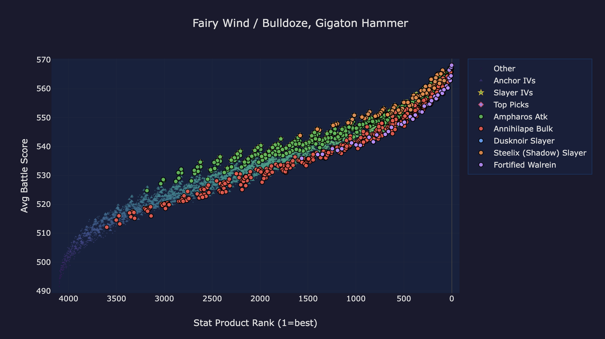

The **envelope position** of a named IV category answers one question:
when IVs in this category win, are they winning because the IVs
themselves are special, or because almost any IV at the same stat-
product rank would be winning those matchups?

That distinction matters when you're deciding which IV to chase. A
category that "rides above" the Anchor IVs band at its rank is doing
something that the rank alone doesn't buy you. A category that
"straddles" the band is doing roughly what rank already predicts, and
chasing a specific IV inside it isn't worth extra effort.

## What the Anchor IVs band is

Every dive has an **Anchor IVs** overlay on the scatter plot - a set
of reference IVs (usually rank-1-by-stat-product or a small neighborhood
around it) that serve as the "what you'd naturally build" baseline. For
every stat-product rank, there's a set of anchor IVs at that rank and
an average battle score for that set. Stacked across every rank, those
averages trace out a **band**: a smooth curve of "what score do you
get at rank N if you don't go out of your way to pick a specific
flavor?"

The envelope metric asks, for each named category (each row on the IV
Flavor Guide, each card in Notable IVs, each tier in Threshold Tiers):
**at matching stat-product rank, does this category's score sit above,
below, or on the band?**

<figure>

<figcaption>
Scatter plot from the Tinkaton UL dive. The grey triangle band is the
Anchor IVs overlay. Orange <strong>Steelix (Shadow) Slayer</strong>
tightly rides the top edge (envelope-rider-top). Red
<strong>Annihilape Bulk</strong> tightly rides the bottom
(envelope-rider-bottom). Green <strong>Ampharos Atk</strong> sits
elevated above the band but spreads across it (elevated-band-crosser).
Three of the four shape classes in one frame.
</figcaption>
</figure>

## The four shapes

Each category carries a shape label, derived from two numbers:

- **mean_delta** - the signed average, in battle-score units, of how
  far this category's members sit from the anchor band at their
  matching ranks. Positive means above the band; negative means below.
- **spread** - the stdev of the per-member deltas. A small spread means
  every member sits at roughly the same distance from the band; a
  large spread means some members beat the band and others fall below
  it.

The classifier splits on the ratio `|mean_delta| / spread`. If the
mean is at least 1.5x the stdev, the category is a **rider** (members
consistently on one side of the band). Otherwise it's a
**band-crosser** (members scatter across the band; the sign of the
mean tells you which way the scatter tilts).

That gives four named shapes. The first, second, and fourth each
have a labeled trace on the screenshot above; the third
(depressed-band-crosser) appears in Tinkaton UL only as
single-matchup cohorts that don't get dedicated traces.

- **Rides top of anchor band** (`rider-top`) - members consistently
  above the band. These earn their spot on top of the score
  distribution not by rank alone but by some property of the IV
  cut itself. For example, see the
  Steelix (Shadow) Slayer
  trace in the screenshot above - a tight cluster hugging the upper
  edge of the grey Anchor IVs band.
- **Straddles band (net +)** (`elevated-band-crosser`) - mixed, but
  averages above the band. The cut helps on average; chasing a
  specific member IV isn't strictly required. For example, the
  Ampharos Atk
  trace above - clearly elevated overall, but visibly spread across
  the band rather than hugging the edge.
- **Straddles band (net -)** (`depressed-band-crosser`) - mixed,
  averages below. The cut hurts on average; clearing the tier in
  question may not be worth the trade.
- **Rides bottom of anchor band** (`rider-bottom`) - members
  consistently below. Category to avoid. For example, the
  Annihilape Bulk
  trace above - a tight cluster hugging the bottom edge of the
  anchor band.

A fifth label, `sparse`, fires when the category has too few members
or too few anchors for the metric to be informative. The dive renderer
skips sparse categories entirely rather than showing a misleading tag.

## Where the tag shows up on a dive

Two places:

1. **Per-category, on the Notable IVs cards** and on tier cards in
   Threshold Tiers. The tag line reads like:

   > **Envelope:** Straddles band (net -) (avg -0.3, spread 0.9)

   Hover the tag for a full tooltip: "Avg battle-score delta vs the
   anchor-IV band at matching stat-product rank. -0.3 average, spread
   0.9 (stdev) across 7 members and 2617 anchor IVs."

2. **At the top of the page in the Overview / Meta Role narrative**,
   as a single sentence counting how many categories land in each
   bucket. On the reference {{dive:species_display}}
   {{dive:league_display}} dive, it reads:

   > **Envelope shape.** {{dive:envelope_rider_top_count}} of
   > {{dive:envelope_classified_count}} named categories ride above
   > the anchor band ...; {{dive:envelope_rider_bottom_count}} ride
   > below ...; {{dive:envelope_straddler_count}} straddle.

## How to read the numbers on a tag

The two numbers in parentheses (`avg X, spread Y`) tell you what you're
looking at:

- **avg close to 0** means the category is sitting roughly on the
  band. Score-wise, members are interchangeable with what a typical
  rank-matched anchor IV would produce. Skip.
- **avg large (positive or negative), spread small** means everyone in
  the category is reliably off the band in the same direction. A
  `+2.8 avg, 0.4 spread` rider tag is saying: "every member beats the
  band by 2-3 points; zero of them are edge-cases."
- **avg moderate, spread large** means the category has mixed wins and
  losses across its members. A `+0.5 avg, 1.4 spread` tag says:
  "on average members beat the band a little, but picking the wrong
  specific IV inside this category can put you below it." Here the
  specific IV matters - chasing a named member of the category is the
  only way to collect the positive tail.

A rule of thumb: `spread` under ~0.5 means the members behave as a
tight cluster; over ~1.5 means they scatter. `mean_delta` in the
single digits is typical (battle scores live in the hundreds but
delta-vs-band is usually small); a mean_delta above 3 is a strong
signal in either direction.

## Worked example: {{dive:species_display}} in {{dive:league_display}}

Looking at the envelope count on the reference dive:
{{dive:envelope_rider_top_count}} categories ride above,
{{dive:envelope_rider_bottom_count}} ride below, and
{{dive:envelope_straddler_count}} straddle the band (out of
{{dive:envelope_classified_count}} classified).

That distribution is typical for a mid-role species: the overwhelming
majority of categories straddle, which means the rank-matched anchor
band is a strong predictor of outcome. The handful of riders are the
interesting ones - either ship-quality picks (rider-top) or explicit
traps (rider-bottom) where the mean is persistently off the band.

On the Notable IVs cards you can see the per-category tags: the
composite Slayer-plus-Bulk cards that cover a defensive trade carry
`Straddles band (net -)` tags, which matches the intuition that
trading def-sacrifice for atk gains is a wash on average.

## How to use this when picking an IV

Work the envelope tag together with the category's **member count**
(how many IVs qualify) and the cutoffs themselves:

- **Rider-top + small member count** = the combination to chase. Few
  IVs qualify, but every one that does beats the band. This is the
  "rare but worth the trade" IV.
- **Rider-top + large member count** = free lunch. Most IVs already
  sit here; you don't need to chase anything specific.
- **Straddles band + small member count** = low confidence. The
  category narrows the IV space but the mean effect is flat. Either
  rank or a specific-IV chase is better than chasing this category.
- **Rider-bottom** at any member count = avoid. Members are
  persistently below band.

The **Paste-box CSV overlay** on the scatter plot makes this concrete:
paste your own IVs into the plot, switch to the category whose tag you
like, and see instantly which of your catchable IVs land inside a
rider-top band vs a straddle.

## Where to go next

- **[IV Flavor Guide](../iv-flavor-guide/)** - the purple narrative
  zone that names each flavor and gives you the per-flavor trade-off
  list. Envelope tags sit next to the flavor cards; the two are
  meant to be read together.
- **[Threshold Tiers](../threshold-tiers/)** - tier cards carry the
  same envelope tag as Notable IVs. If a Threshold Tier card says
  "Straddles band," the tier's cutoff is mechanically sound but
  doesn't move the score needle on average.
- **[Deep-Dive Scatter](../deep-dive-scatter/)** - the Anchor IVs
  band is an overlay on the scatter plot; the scatter guide covers
  the Filled / Outline dropdown and how to read the overlay against
  named category traces.
- **[How This Works](../how-this-works/)** - if you want the short
  version of how the underlying simulation and scatter plot are
  built.
