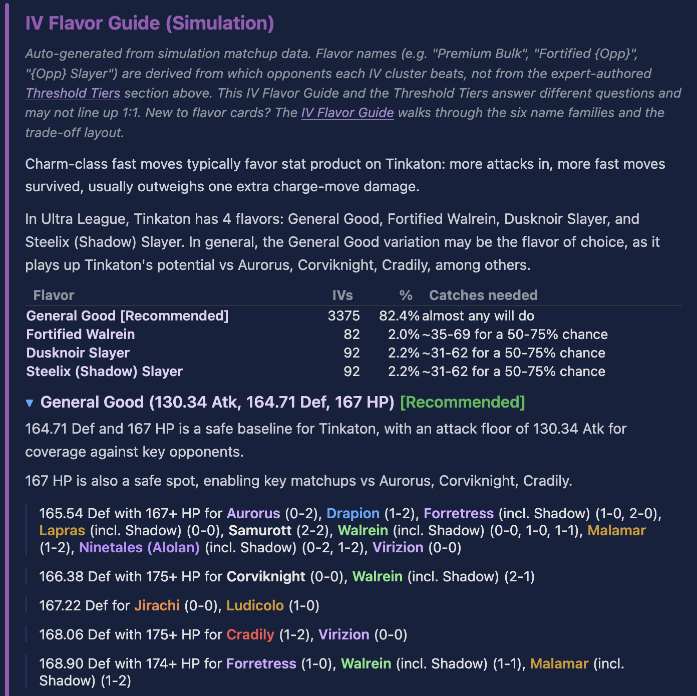

The **IV Flavor Guide** is the purple-bordered zone that sits directly
below the Deep Dive Results header on every dive page. It groups the
IV space into a short list of named play-style archetypes - a
"flavor" - each one paired with the specific matchups that flavor
buys you and the specific matchups it costs.

It's the fastest section to read on the whole page, and it's the
right place to start if you're deciding which IV to chase.

<figure>

<figcaption>
The IV Flavor Guide zone on the Tinkaton UL dive. The summary table
lists the four flavors the simulation derived, each with how many
IVs qualify and how many catches it takes to land one. Below the
table, each flavor expands (the "General Good" one is open here)
with its stat signature, a safe-baseline description, and the
opponent-by-opponent matchups that flavor's stat cutoffs buy you.
</figcaption>
</figure>

## What a flavor is

A flavor is a **named cluster of IVs with a shared stat signature and
a shared strategic intent**. The screenshot above shows the Tinkaton
UL dive's four flavors:
General Good is a
broad "safe baseline" cut covering 82.4% of the IV space;
Fortified Walrein
is a much narrower cut that trades attack range for a defensive
threshold against Walrein;
Dusknoir Slayer
and Steelix (Shadow) Slayer
each give up bulk to clear a specific damage breakpoint against
their namesake opponent.

A flavor is **not** an arbitrary PvPoke preset. It's derived by:

1. Taking the mechanical tier cutoffs from the simulation sweep
   (every atk/def/hp threshold that changes the matchup list).
2. Mapping each cutoff's shape - does it bound attack, defense, HP,
   or a combination - onto a SwagTips-style name family. Pure-def
   cuts become `Fortified {Opp}` or `Premium Bulk`. Pure-atk cuts
   tied to a specific opponent become `{Opp} Slayer`. Broad cuts
   with no single anchor become `General Good`.
3. Attaching the per-flavor trade-off list by partitioning the IV
   space at the flavor's cut and comparing the flavor cohort's
   win rate against the General cohort's win rate across every
   opponent in the dive's pool.

The code that does this is `refine_flavor_names` in
`scripts/deep_dive_narrative.py`. The name is the editorial label;
the cluster is the mechanical output.

## The six name families

Every flavor you see on a dive comes out of one of six families. The
family is chosen from the shape of the cut (atk, def, hp, or a
combination) plus whether the cut is tied to a specific opponent:

- **General Good** - a broad cut with atk, def, and hp floors, no
  single opponent anchor. This is the "recommended" flavor on most
  dives; clearing it gets you the bulk of the species' meta coverage
  without chasing anything specific.
- **Premium Bulk** - a def + hp cut with no atk floor. The defensive
  counterpart to General Good: the cut narrows to bulkier IVs, but
  isn't tied to a named opponent.
- **Attack Weight** - a pure atk cut with no def or hp floor. Narrows
  to the high-atk tail of the IV space; usually surfaces on species
  whose role is "open with a charged move, win by damage race."
- **High Bulk** - a pure def cut, no atk or hp floor. Rarer; usually
  a species-specific pattern where the hp dimension doesn't carry
  a bulkpoint.
- **{Opponent} Slayer** - a cut (atk, or atk + hp) tied to a
  specific opponent's damage breakpoint. Lapras Slayer, Tinkaton
  Slayer, etc. The cutoff is the attack threshold at which one of
  the focal's moves steps up a damage tier against that opponent,
  plus any HP requirement from the neighboring matchup boundary.
- **Fortified {Opponent}** - a cut (def, or def + hp) tied to a
  specific opponent's bulkpoint. Fortified Greedent, Fortified
  Clodsire, etc. The cutoff is the defense threshold at which one
  of the opponent's moves steps **down** a damage tier against the
  focal.

A seventh family, **TOML-defined**, covers cases where a human has
given the flavor a specific name in `thresholds/<species>.toml`
(e.g. "GL-General Good", "Slight Atk Weight"). The renderer passes
those through unchanged.

## How to read the zone

Top of the zone: a one-sentence species-level summary ("In Great
League, {{dive:species_display}} has N flavors: A, B, C") plus an
overview table with one row per flavor:

| Flavor                     |  IVs |     % | Catches needed     |
| -------------------------- | ---: | ----: | ------------------ |
| General Good [Recommended] | 4027 | 98.3% | almost any will do |
| Fortified Greedent         |   38 |  0.9% | ~75-149 for 50-75% |
| Lapras Slayer              |   46 |  1.1% | ~62-123 for 50-75% |

(Numbers above are from the reference {{dive:species_display}}
{{dive:league_display}} dive; the actual table on your dive shows
its own values.)

The **IVs** column is the count of IV spreads out of
{{dive:iv_space_size}} that meet this flavor's stat cuts. The
**Catches needed** column is the expected number of catches to hit
at least one qualifying IV with 50-75% probability, assuming
uniformly random IVs (accurate for wild catches; less accurate for
traded or raid Pokemon with their own IV floors).

Below the table, each flavor has its own collapsible card:

- **Header**: flavor name + stat signature (e.g. `93.67 Def, 148 HP`).
  The stat signature is the minimum each constrained axis has to
  clear.
- **Body - gains paragraph**: a short sentence naming the opponents
  and shield scenarios this flavor wins relative to the General
  cohort.
- **Body - losses paragraph** (only shown for non-General flavors):
  the matchups the flavor gives up relative to General. This is the
  trade.
- **Body - threshold ladder** (on General): a bulleted list of the
  exact def / atk / hp combinations that clear specific opponents.
  This is the "what is each part of the cut buying me" detail.

The cards default to the General flavor open and the rest collapsed.
Click any header to expand.

## The namesake guarantee

For `{Opp} Slayer` and `Fortified {Opp}` flavors, the flavor's name
**names a specific opponent** - and that opponent is guaranteed to
appear in the gains list. Lapras Slayer wins Lapras. Fortified
Greedent wins Greedent. This is a hard invariant enforced by the
renderer: if the cut's mechanics don't actually flip the named
matchup, the flavor gets a different name (or gets dropped).

The namesake guarantee means the flavor card can be read as a
contract: **"name the opponent in the flavor, look at the gains
list, verify the matchup is there."** If it isn't, that's a bug in
the renderer and worth reporting.

Two namesakes can't merge into one flavor: if two cuts produce the
same stat signature, they end up as separate cards with
disambiguators in the name (e.g. `Lapras Slayer (123.74+ Atk)` vs
another slayer sharing the cut).

## Distinction from Threshold Tiers

Threshold Tiers and the IV Flavor Guide answer **different questions
about the same data**. They overlap, sometimes confusingly, and the
distinction is worth getting straight:

- **Threshold Tiers** tell you *"what cutoff do I need to clear to
  hit this tier, and which IVs qualify?"* Tier cards are named
  after their mechanical anchor (e.g. "Lapras Slayer" because the
  cut comes from Lapras's breakpoint), list every IV spread that
  meets the cut, and show you the full list of per-opponent anchors
  the tier clears. Tier cards are **mechanical**.
- **IV Flavor Guide** tells you *"what archetype does this cluster
  of IVs represent, and what trade does picking it make?"* Flavor
  cards name the play-style, name one or two load-bearing gains,
  name one or two load-bearing losses, and skip the exhaustive
  anchor list. Flavor cards are **editorial**.

The tier-name unify (shipped 2026-04-23) means the two surfaces now
share the same flavor name: a Threshold Tier card named "Lapras
Slayer" and the flavor card named "Lapras Slayer" refer to the same
cut. But you read them for different reasons. Start with the flavor
card if you haven't picked a direction; drop into the tier card
once you want the full anchor list.

A note the dive itself carries above the zone: *"This IV Flavor
Guide and the Threshold Tiers answer different questions and may
not line up 1:1."* The places they don't line up are usually:

- A flavor with a namesake has a small member count driven by the
  gain, but a tier with the same cut may list many more opponents
  it incidentally clears.
- A tier with no named anchor ("General" or "Atk X+") has no
  flavor-side name drama - the flavor just becomes "General Good"
  or "Attack Weight."
- TOML-authored tier names pass through to flavor names unchanged;
  auto-derived tier names get mapped through `refine_flavor_names`.

## Worked example: {{dive:species_display}} in {{dive:league_display}}

Three flavors on the reference dive, in the order they're presented:

**General Good** (~98% of the IV space) - the broad cut. 93.67 Def
and 148 HP as a bulk baseline, 115.50 Atk as a coverage floor.
Doesn't chase a specific opponent; sits above most of the meta. The
threshold-ladder in its card names every opponent and scenario the
General floor unlocks (Azumarill 1-1, Clodsire 1-1, Empoleon incl.
Shadow, and so on). Recommended for most players.

**Fortified Greedent** (~38 IVs) - defensive namesake. Trades
attack range (no atk floor) for a 104.18 Def cut with 153 HP.
Gain: Greedent 0-0, Charjabug 1-1, Cradily 1-0 flip into wins.
Loss: Forretress 2-0, Furret 2-1, Lickilicky 2-2 drop out (the
higher def cut excludes def-sacrificing IVs that clear other
matchups via the attack side). Genuinely rare cut - the catch
count needed for a 50% chance of hitting one is in the 70s.

**Lapras Slayer** ({{dive:top_tier_clear_count}} IVs) - offensive
namesake. Trades bulk (no def floor) for a
{{dive:top_tier_atk_cutoff}} Atk cut, the smallest attack that flips
Lapras's breakpoint with the featured moveset. Gain: Lapras 2-1,
Altaria 2-0, Charjabug 0-0. Loss: Azumarill 1-1, Clodsire 1-1,
Corsola (Galarian) 0-0 drop out (low-def IVs lose the defensive
matchups). Similar rarity to Fortified Greedent.

Reading the three together: General is the default pick; the two
namesakes are the trades to consider if you care about the
Greedent-family defensive matchup or the Lapras 2-1 flip
specifically. The envelope tag next to each (see the
[Envelope Position](../envelope-position/) guide) tells you whether
the flavor's members reliably beat the anchor band or just tilt in
the right direction on average.

## Where to go next

- **[Threshold Tiers](../threshold-tiers/)** - the mechanical tier
  cards that drive the flavor-naming. When a flavor says "Lapras
  Slayer," the Threshold Tier with the same name is where the
  cutoff came from.
- **[Envelope Position](../envelope-position/)** - each flavor
  carries an envelope tag (rider-top, straddles band, etc.). The
  tag tells you whether the flavor's win-rate lift is consistent
  across members or only shows up on a specific sub-cluster.
- **[Reading a CD Article](../cd-article/)** - the CD article's IV
  Recommendations card grid is a compact distillation of the flavor
  cuts, one card per form.
- **[How This Works](../how-this-works/)** - if you want the short
  version of how the simulation sweep that powers all of this is
  built.
