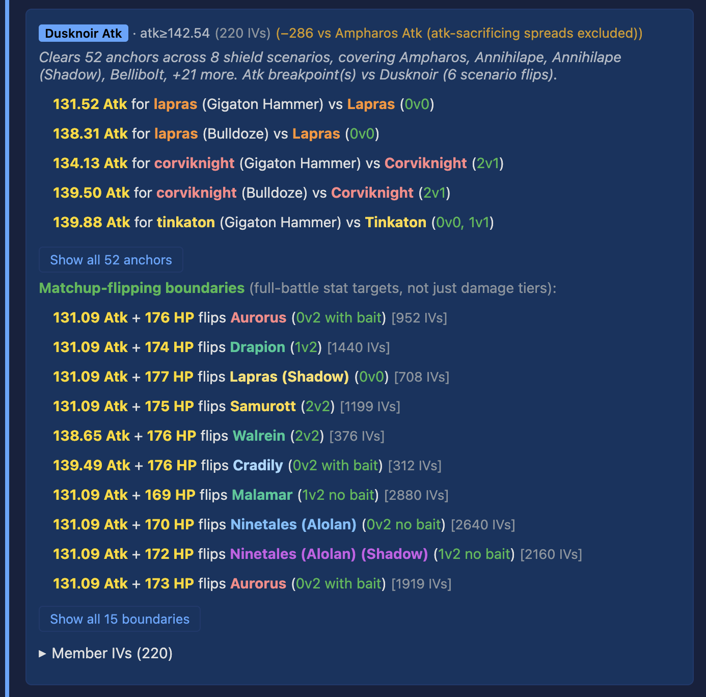

A threshold tier is a named stat cutoff that an IV spread has to clear
to reach the next meaningful battle outcome against a notable opponent. This
page is about the **Threshold Tiers** section of a deep dive - what the
cards show you, what the numbers mean, and how to use them when you're
picking which IV to invest in.

## What a tier card actually shows

<figure>

<figcaption>
The <strong>Dusknoir Atk</strong> tier card from the Tinkaton UL
dive. Header: the tier-name badge, the stat cutoff
(<code>atk&ge;142.54</code>), the member count (220 IVs), and a
parent-tier diff callout explaining what this stricter tier trades
vs. the next looser one. Below the header: two lists. The
<strong>anchor bullets</strong> (top) are pure damage breakpoints
("X Atk flips Y against Z"). The <strong>Matchup-flipping
boundaries</strong> (bottom) are full-battle boundaries that
usually include an HP co-floor - the full 1v1 outcome flips at
<code>131.09 Atk + 176 HP</code>, not just the damage tier. The
distinction matters: anchors tell you what a move does, boundaries
tell you what a whole fight does.
</figcaption>
</figure>

Three things to read off the tier card header in the screenshot:

1. **The tier name.** It's usually "(opponent) Atk" or "(opponent)
   Bulk" or "Fortified (opponent)" - a shorthand for "this tier is
   defined by a specific breakpoint or bulkpoint against that
   opponent." Expert-authored tiers keep their authored names instead
   (e.g. "GH Great" / "GH Good" on the Tinkaton dives). In
   the screenshot, the
   Dusknoir Atk
   badge means this cutoff was derived from a damage breakpoint
   against Dusknoir.
2. **The stat cutoff.** The part after the middle dot is what an IV
   spread has to clear to be a member of the tier. `atk ≥ 142.54`
   means the IV spread's effective attack stat (base + IV, at the
   level the CP cap allows) has to be at least 142.54. A tier can have any combination
   of `atk ≥`, `def ≥`, and `hp ≥` cutoffs; stats without a cutoff
   aren't restricted.
3. **The member count in parentheses.** `220 IV spreads` means that
   many of the 4096 possible IV spreads clear this tier's cutoffs. The
   higher the number, the easier the tier is to hit with a catchable
   IV spread; the lower, the rarer.

Below the header, each card carries a list of anchor bullets - the
specific matchup flips this tier buys you. The Dusknoir Atk card in
the screenshot lists Lapras, Corviknight, and Tinkaton bullets
alongside the namesake Dusknoir bullet - because clearing a stricter
atk cutoff like `142.54` automatically clears every looser atk cutoff
(131.52 Atk for Lapras, 134.13 Atk for Corviknight, etc.) at the
same time.

## Tier vs anchor vs category

These three words show up near each other and it's worth being precise:

- An **anchor** is a single per-opponent rule. "Your attack has to be
  at least X to cross Lapras's damage breakpoint" is one anchor.
  Anchors are the raw material.
- A **tier** is a named card in the IV Recommendations grid, usually
  backed by one anchor (the one the tier is named after) but with
  every other anchor it clears listed in the bullets below. Tiers are
  what the dive shows you.
- A **category** is a higher-level grouping used in the Per-matchup
  IV finder (collapsed inside IV Recommendations). Slayer categories
  (Anchors-First Slayer / CMP-First Slayer) sort IVs by strategy;
  composite categories are intersections like "Anchors-First Slayer
  AND Top 5% by stat product" that call out the rarer IVs. Categories
  are read laterally across many tiers at once.

If you're reading a dive for the first time, start with tiers. Go to
categories once you've picked out one or two tier cards that look
relevant.

## Why tiers overlap

Two things make tiers overlap, and both are intentional.

**Stricter cutoffs contain looser ones.** When one tier's atk cutoff
sits above another's (on the reference dive, Grumpig Slayer's
`atk >= 116.44` vs Oinkologne Atk's `atk >= 116.03`), any IV spread
that meets the stricter cutoff automatically meets the looser one. So
the stricter tier's bullet list is a **superset** of the looser
tier's bullets. The dive surfaces this deliberately rather than
de-duplicating: a card telling you everything a cutoff buys at once
is more informative than one that only lists the namesake matchup.

**Crossed-axis tiers don't contain each other.** A tier that only
cares about attack (say, "Lapras Slayer") and a tier that only cares
about defense (say, "Fortified Greedent") don't sit on the same axis
at all. Atk anchors show up on one card, def anchors on the other,
and the IVs that clear both are a separate rare intersection that the
Per-matchup IV finder usually calls out.

When two tiers share the same primary anchor but different member
counts - one says `atk >= 123.74, def >= 100` and the other just
`atk >= 123.74` - the dive puts a small `(-N vs parent)` note on
the stricter tier's header so you can see at a glance that the
stricter one trades off def-sacrificing (or hp-low) IV spreads the
looser one keeps.

## How to use the clear count

The `{{dive:top_tier_clear_count}} IV spreads` style member count is
the single most actionable number on a tier card.

- **Above ~500** (roughly 1/8 of the 4096 IV space): common tier. A
  typical catch will already clear it, or will clear it with minor
  XL investment. You shouldn't have to chase a specific IV spread for
  this tier unless the cutoff is on the edge of something you catch.
- **~100-500**: selective but attainable. Worth checking your paste-box
  highlights on the scatter plot to see which of your catchable IV
  spreads already qualify.
- **Under ~100**: genuinely rare. If a named matchup requires this
  tier, the IV recommendation on the card is telling you to
  deliberately target that spread (trade, egg-hatch filter, or
  specific-level XL lock).

Those ranges are rules of thumb, not hard lines. What matters is the
**relative ordering**: a tier with 46 members is an order of magnitude
rarer than one with 460, and the paste-box overlay will show
which of your catchable IV spreads fall inside each.

## One worked example, quickly

{{dive:species_display}} {{dive:league_display}} has
{{dive:tier_count}} threshold-tier cards on its featured moveset.
The top card - {{dive:top_tier_name}} - cuts on bulk: `def &ge;
{{dive:top_tier_def_cutoff}}` with an HP floor of
`{{dive:top_tier_sta_cutoff}}`, and {{dive:top_tier_clear_count}} of
the {{dive:iv_space_size}} IV spreads meet it. That means clearing
that tier isn't free; it rules out nearly every attack-weighted IV
spread. But every IV spread that does meet it also flips the matchups
listed as primary bullets below - the namesake bulkpoint plus every
looser cutoff on the same axis for this moveset.

Read the card top-down: tier name tells you what opponent drives the
cutoff; the cutoff tells you what stat you need; the member count
tells you how selective it is; the bullets tell you what matchups you
gain by clearing it; and the member-IV list (collapsed at the bottom
of the card) tells you which specific IV spreads qualify. That's the
whole surface.

## Where to go next

- **[IV Flavor Guide](../iv-flavor-guide/)** - covers the teal IV
  Flavor Guide zone that sits next to Threshold Tiers on the dive
  page and explains how the Plotly legend's names (like "Lapras
  Slayer") relate to the tier cards' auto-derived names (like
  "{{dive:top_tier_name}}").
- **[Envelope Position](../envelope-position/)** - covers how a
  tier's bullets classify as "rider" or "band-crosser" shapes and
  what that says about how robust the tier's advantage is.
- **[Deep-Dive Scatter](../deep-dive-scatter/)** - the scatter plot
  at the top of every dive colours points by tier membership. The
  scatter is where you see which specific IVs land in each tier.
- **[Reading a CD Article](../cd-article/)** - the CD article's IV
  Recommendations card grid points into tier cards from each form's
  paired dive.
- **[How This Works](../how-this-works/)** - if you want the short
  version of how the underlying simulation is built.
